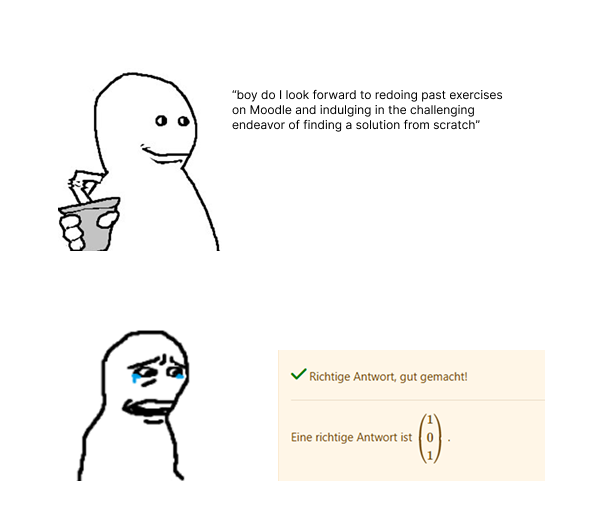
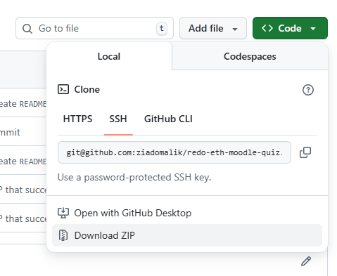
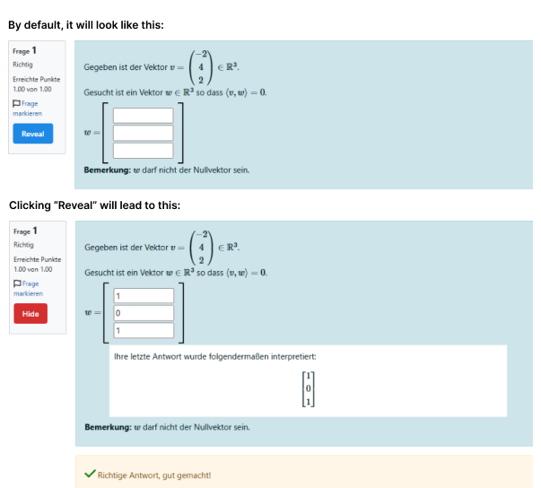

### Installation

> [!IMPORTANT]  
> This extension is only compatible with Chrome or Chromium-based browsers like Brave, Edge, etc.

1. Download the this repository as a zip file & unzip it.

2. Go to `chrome://extensions` (or just search for "extensions" in the browser's search bar)
3. Enable "Developer mode" in the top right corner.
4. Click "Load unpacked" in the top left corner and select the folder you unzipped in step 1.
5. Refresh the quiz page if you have it open and you're good to go!

### Usage

Once you've installed the extension, just open a past quiz and you'll have the previous answers hidden by default. 
In the question title box, you will find a new button that you can use to toggle the answers back on and off.

